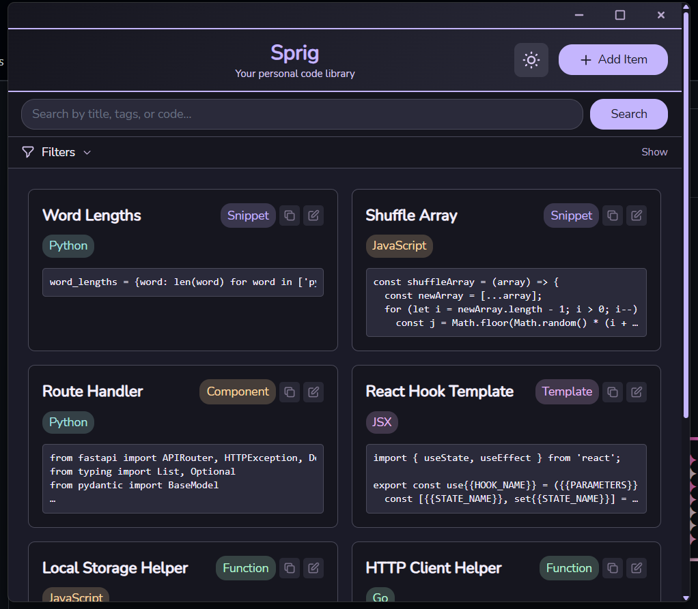
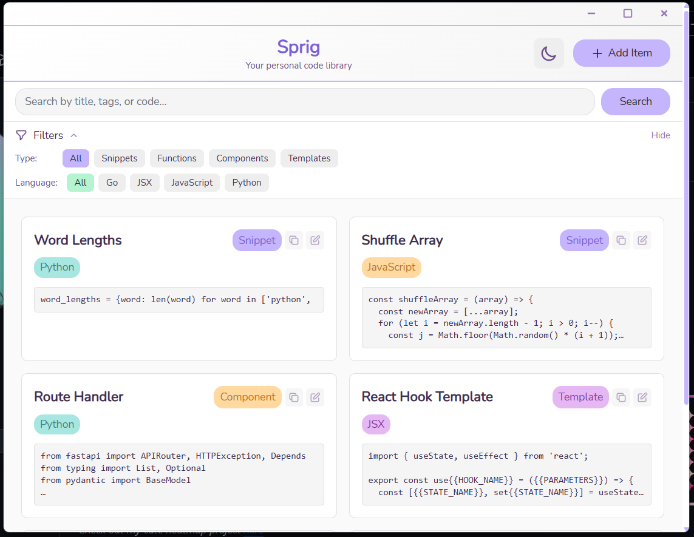
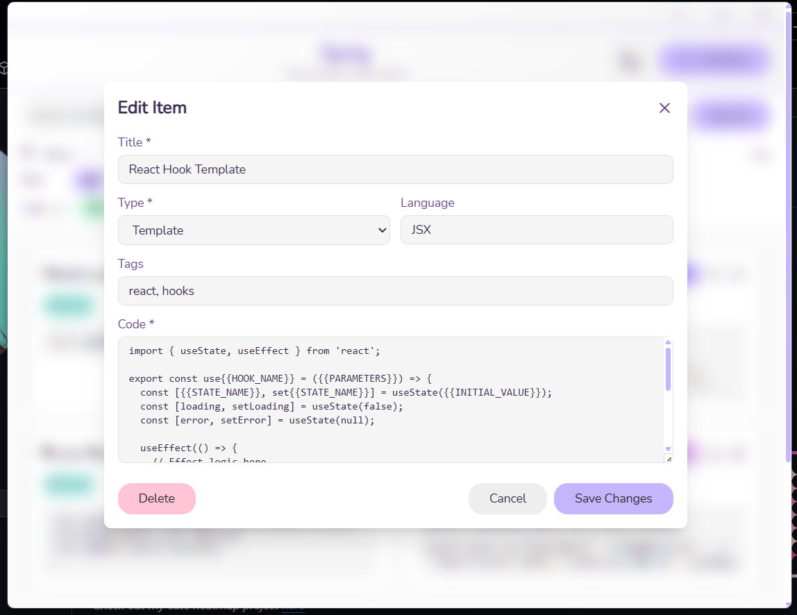
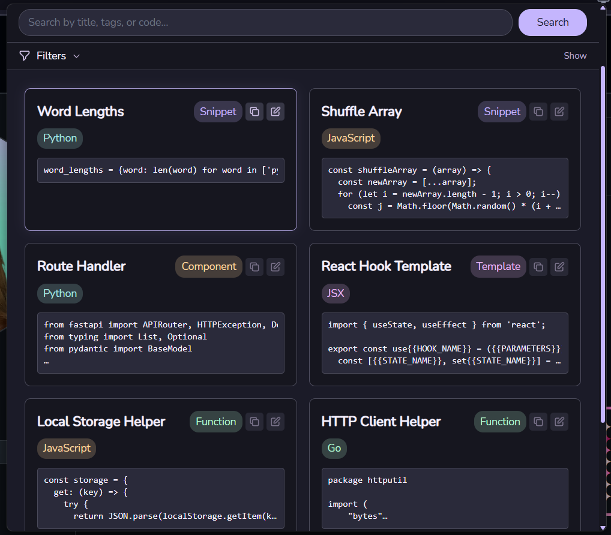

<div align="center">
  
</div>

# Sprig

A desktop application for managing your personal code library. Save, organize, search, and retrieve code snippets, functions, and templates with easy tagging and categorization.

Built with [Wails](https://wails.io/) (Go + React). Also includes a companion VS Code extension for seamless integration with your editor.



## Installation

### Windows (Recommended)
Download the latest release from [Releases](https://github.com/Emmyme/sprig/releases) - no build required.

### Build from Source
For other platforms or development:

1. **Prerequisites**
   - Go 1.21+
   - Node.js 16+
   - Wails CLI: `go install github.com/wailsapp/wails/v2/cmd/wails@latest`

2. **Clone and Build**
   ```bash
   git clone https://github.com/Emmyme/sprig.git
   cd sprig
   wails build
   ```

3. **Development Mode**
   ```bash
   wails dev
   ```



## Features

- **Code Organization**: Save snippets, functions, components, and templates
- **Multi-Language Support**: Works with any programming language
- **Fast Search**: Find code by title, content, tags, or language
- **Tagging System**: Organize with custom tags and categories  
- **Theme Support**: Light and dark themes
- **Local Storage**: SQLite database (stored in `~/.sprig/`)
- **VS Code Integration**: Companion extension for editor workflow



## Tech Stack

- **Backend**: Go
- **Frontend**: React + TypeScript  
- **Framework**: Wails v2
- **Database**: SQLite



## VS Code Extension

Install the companion extension `Emmyme.sprig` from the VS Code Marketplace. It shares the same database as the desktop app, allowing you to:
- Save code selections directly from your editor
- Search and insert saved snippets
- Access your library without leaving VS Code

## Database

Sprig uses SQLite for local storage:
- **Windows**: `%USERPROFILE%\.sprig\sprig.db`
- **macOS/Linux**: `~/.sprig/sprig.db`

The database is shared between the desktop app and VS Code extension.

## License

This project is licensed under the MIT License - see the [LICENSE](LICENSE) file for details.
